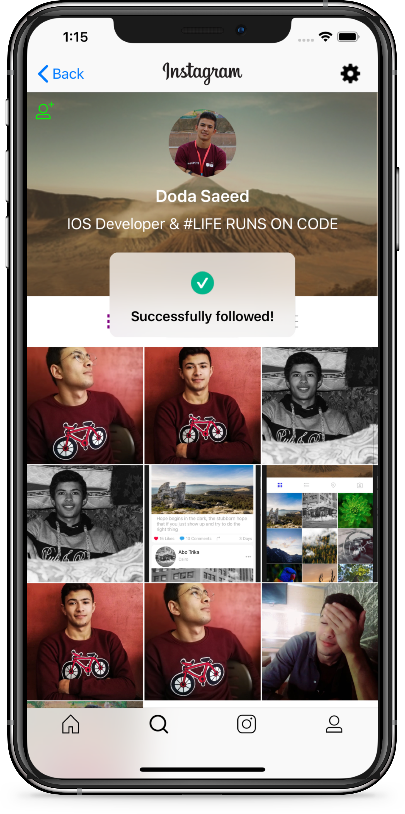
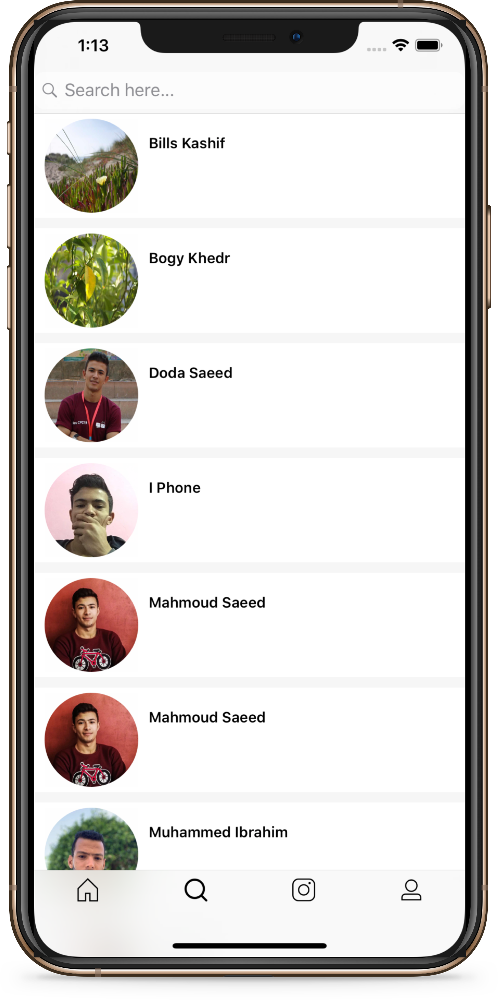
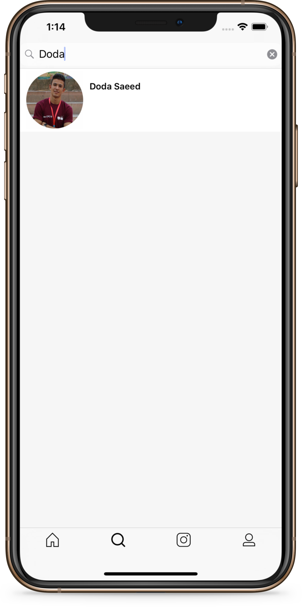
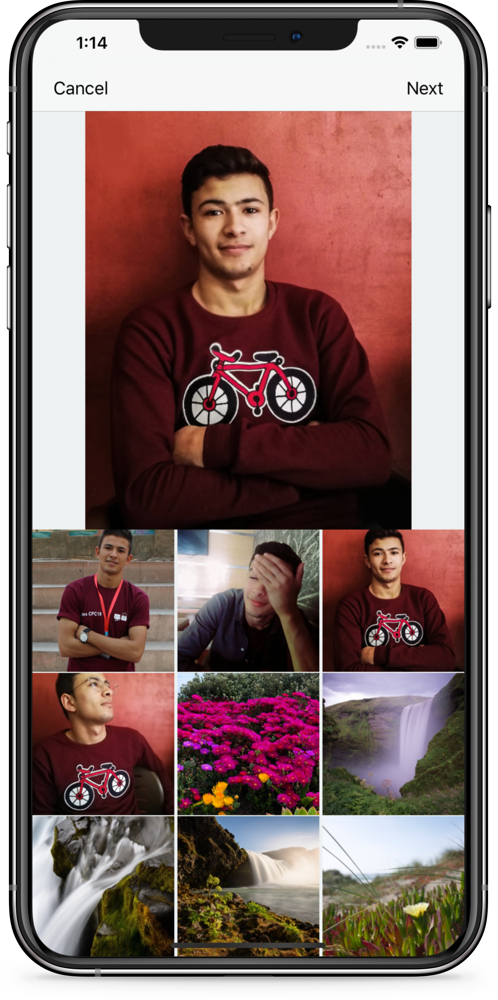

# Instagram

Instagram app is a Design only app based on Swift language v 4.2 and Firebase.
There is no StoryBoard.
All design build programmatically.
Pretty simple design hopefully you guys like it.

## Time Line

## Following people

## Explore who is with you

## Search for specific people to follow

## Share your photos and add your own captions

## Easy to register

